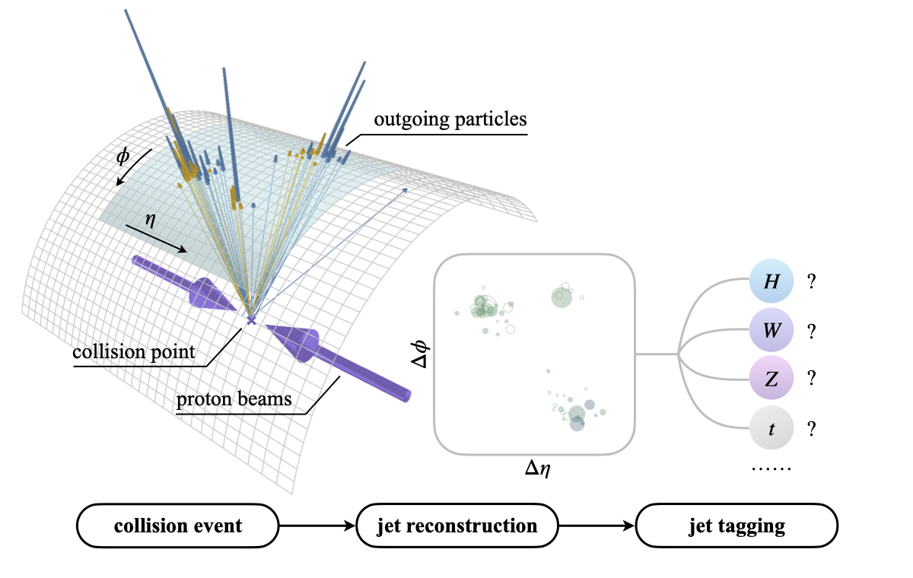

# Particle Transformer - V2

This repository contains an implementation of "[Particle Transformer for Jet Tagging](https://arxiv.org/abs/2202.03772)," including the code, pre-trained models, and the JetClass dataset. This updated version incorporates new scripts for automated training, evaluation, and plotting, streamlining the process of comparing different models, feature sets, and dataset sizes.



## What's New in V2?

Version 2 introduces a suite of new scripts designed to automate and enhance the model training and evaluation workflow. Key additions include:

* **Automated Training Script (`run_training_comparisons_clean.sh`)**: A robust script to run a series of training comparisons with built-in temperature monitoring and cooldown periods to prevent overheating.
* **Comprehensive Evaluation Script (`evaluate.sh`)**: A script that automates the process of generating comparison plots for different models, feature sets, and dataset sizes.
* **Advanced Plotting and Analysis**: New Python scripts for generating detailed ROC curves, background rejection plots, and macro performance comparisons.
* **Corrected Evaluation Metrics**: The evaluation scripts now use a normalized discriminant score for more accurate binary classification evaluation in a multi-class setting.
* **Additional Utilities**: Tools have been added to monitor training progress in real-time and to create smaller, sampled versions of the datasets for quick tests.

---

## Introduction

### The JetClass Dataset

**[JetClass](https://zenodo.org/record/6619768)** is a new large-scale jet tagging dataset proposed in "[Particle Transformer for Jet Tagging](https://arxiv.org/abs/2202.03772)." It consists of 100M jets for training, 5M for validation, and 20M for testing. The dataset contains 10 classes of jets, simulated with [MadGraph](https://launchpad.net/mg5amcnlo) + [Pythia](https://pythia.org/) + [Delphes](https://cp3.irmp.ucl.ac.be/projects/delphes).


### Particle Transformer (ParT)

The **Particle Transformer (ParT)** architecture is described in "[Particle Transformer for Jet Tagging](https.arxiv.org/abs/2202.03772)," and can serve as a general-purpose backbone for jet tagging and similar tasks in particle physics. It is a Transformer-based architecture, enhanced with pairwise particle interaction features that are incorporated in the multi-head attention as a bias before the softmax function. The ParT architecture outperforms the previous state-of-the-art, ParticleNet, by a large margin on various jet tagging benchmarks.


---

## Getting Started

### 1. Download the Datasets

To download the JetClass, QuarkGluon, or TopLandscape datasets, use the provided script:

```bash
./get_datasets.py [JetClass|QuarkGluon|TopLandscape] [-d DATA_DIR]
After the download is complete, the dataset paths will be automatically updated in the env.sh file.
```

### 2. Install Dependencies
The training framework is built on PyTorch and utilizes the weaver library for data loading and transformations. To install weaver, run:

```bash
pip install 'weaver-core>=0.4'
```

### 3. Automated Training (New in V2)
The new run_training_comparisons_clean.sh script allows for running a series of training jobs in a safe and automated manner.

Configuration
Open run_training_comparisons_clean.sh and configure the following variables to define your training runs:

MODELS: An array of models to train (e.g., "ParT", "PN").

FEATURES: An array of feature sets to use (e.g., "kin", "kinpid", "full").

DATASET_SIZES: An array of dataset sizes to train on (e.g., "1M", "2M", "10M").

Running Automated Training
Execute the script from your terminal:

```bash
./run_training_comparisons_clean.sh
```

The script will iterate through all combinations of the configured models, features, and dataset sizes. It also includes temperature monitoring to prevent your hardware from overheating, with automatic cooldown periods. All training logs will be saved to training_log_YYYYMMDD_HHMMSS.txt and temperature logs to temperature_log_YYYYMMDD_HHMMSS.txt.

### 4. Manual Training
You can still run individual training jobs using the train_JetClass_fix.sh script (an updated version of the original training script).

Training on the JetClass Dataset
To run a single training on the JetClass dataset:

```bash
./train_JetClass_fix.sh [ParT|PN|PFN|PCNN] [kin|kinpid|full] [1M|2M|10M|100M]
```

First argument: The model architecture (ParT, PN, PFN, or PCNN).

Second argument: The input feature set (kin, kinpid, or full).

Third argument: The size of the training dataset.

Additional arguments can be passed to the weaver command, such as --batch-size, --start-lr, and --gpus.

#### Multi-GPU Support
DataParallel:

```bash
./train_JetClass_fix.sh ParT full 10M --gpus 0,1,2,3 --batch-size [total_batch_size]
```

DistributedDataParallel:

```bash
DDP_NGPUS=4 ./train_JetClass_fix.sh ParT full 10M --batch-size [batch_size_per_gpu]
```

### 5. Evaluating Models (New in V2)
The new evaluate.sh script automates the generation of comparative plots from your trained models' predictions.

How to Run the Evaluation
Simply execute the script:

```bash
./evaluate.sh
```

This will run a series of Python scripts to generate:

Model Comparisons: ROC curves comparing ParT and PN.

Feature Subset Comparisons: ROC curves for kin vs. kinpid vs. full feature sets for both ParT and PN.

Dataset Size Comparisons: ROC curves for models trained on 1M, 2M, and 10M jet datasets.

Macro OVO Comparisons: Bar plots comparing the macro one-vs-one ROC AUC scores.

All generated plots and CSV summaries will be saved in the graficos_comparativos_v5/ directory.


## Additional Tools and Utilities (New in V2)

The following scripts have been added to facilitate development and analysis.

### Monitoring Training Progress (monitor_training.sh)
This script allows you to view the progress of a training run in real-time in a clean and concise manner. It filters the log file to display only the most important metrics.

Usage:

To use it, open a new terminal and run the script, passing the path to the log file being generated during training as an argument:

```bash
./monitor_training.sh [path_to_log_file]

# Example:
./monitor_training.sh logs/JetClass/Pythia/full/ParT/1M/20230101_120000/net.log
```

### Creating Dataset Samples (sample_root_files.py)
Due to the large size of the dataset files, it can be useful to work with smaller samples for quick tests, debugging, or running experiments on hardware with limited resources. This script allows you to create down-sampled versions of the .root files.

Usage:

The script takes an input directory (with the original files), an output directory (where the new files will be saved), and the number of events to sample from each file.

```bash

python sample_root_files.py --input-dir [input_directory] --output-dir [output_directory] --num-events [N]

# Example to create a sample of 1000 events per file:
python sample_root_files.py \
  --input-dir ./datasets/JetClass/Pythia/train_1M \
  --output-dir ./datasets/JetClass/Pythia/train_1k_sample \
  --num-events 1000
```

[README from original repo](https://github.com/jet-universe/particle_transformer/blob/29ef32b5020c11d0d22fba01f37a740a72cbbb4d/README.md)

## Citations

If you use the Particle Transformer code and/or the JetClass dataset, please cite:

```
@InProceedings{Qu:2022mxj,
    author = "Qu, Huilin and Li, Congqiao and Qian, Sitian",
    title = "{Particle Transformer} for Jet Tagging",
    booktitle = "{Proceedings of the 39th International Conference on Machine Learning}",
    pages = "18281--18292",
    year = "2022",
    eprint = "2202.03772",
    archivePrefix = "arXiv",
    primaryClass = "hep-ph"
}

@dataset{JetClass,
  author       = "Qu, Huilin and Li, Congqiao and Qian, Sitian",
  title        = "{JetClass}: A Large-Scale Dataset for Deep Learning in Jet Physics",
  month        = "jun",
  year         = "2022",
  publisher    = "Zenodo",
  version      = "1.0.0",
  doi          = "10.5281/zenodo.6619768",
  url          = "https://doi.org/10.5281/zenodo.6619768"
}
```

Additionally, if you use the ParticleNet model, please cite:

```
@article{Qu:2019gqs,
    author = "Qu, Huilin and Gouskos, Loukas",
    title = "{ParticleNet: Jet Tagging via Particle Clouds}",
    eprint = "1902.08570",
    archivePrefix = "arXiv",
    primaryClass = "hep-ph",
    doi = "10.1103/PhysRevD.101.056019",
    journal = "Phys. Rev. D",
    volume = "101",
    number = "5",
    pages = "056019",
    year = "2020"
}
```

